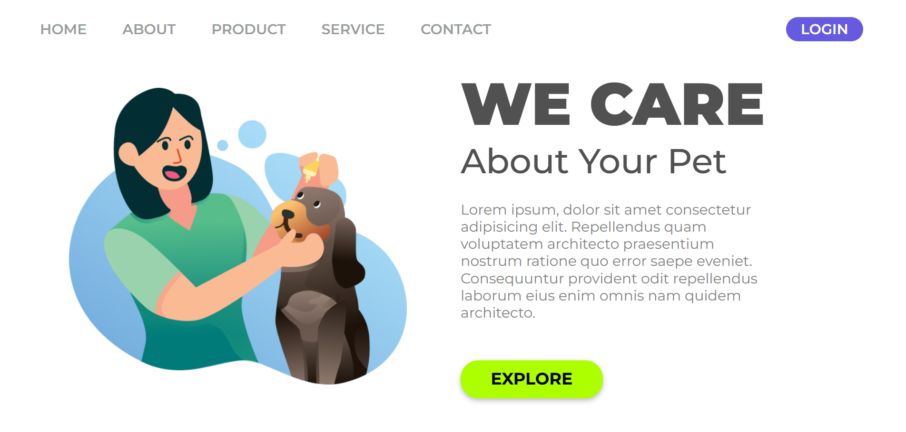

# 🐾 Pet Care Landing Page

Uma landing page moderna para cuidados com pets, desenvolvida com HTML e CSS.

## 🚀 Tecnologias utilizadas

* HTML5
* CSS3
* Google Fonts
* Figma

## 🎨 Funcionalidades

* Layout moderno
* Header estilizado
* Botões com efeito hover
* Interface intuitiva

## 📸 Preview do Projeto



## 💻 Como executar o projeto

Clone o repositório:

```bash
git clone https://github.com/JulianaMatos-j/pet-care-landing-page.git
```

Abra a pasta do projeto e execute o arquivo:

```bash
index.html
```

## 📚 Sobre o projeto

Esse projeto foi desenvolvido através de videoaulas para praticar HTML e CSS, além de treinar a criação de interfaces a partir de um design no Figma.

## 🧠 O que pratiquei

* Estrutura HTML
* Estilização com CSS
* Flexbox
* Hover e transições
* Organização de layout
* Transformar um design do Figma em código

## 👩‍💻 Desenvolvedora

Feito com 💜 por Juliana Matos
